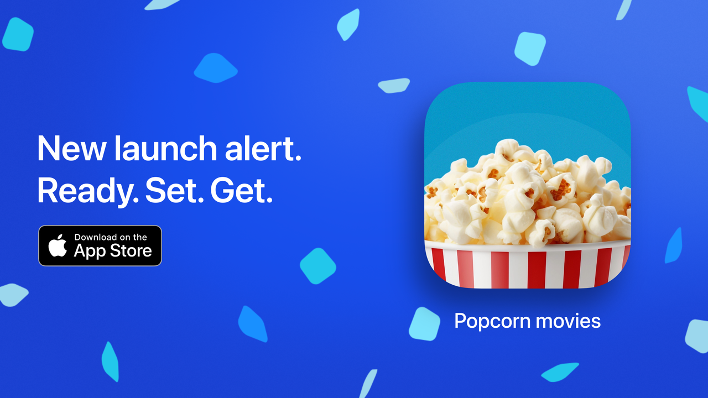

    <picture>
        <source media="(prefers-color-scheme: dark)" srcset="./public/img/apple-banner.png">
        <source media="(prefers-color-scheme: light)" srcset="./public/img/apple-banner.png">
        
    </picture>

# Popcorn IOS Application

Save films & tv shows to watch later

### Installation & configuration

> [!IMPORTANT]
> This project and documentation are still in development and the structure can change until a stable version is released. Use with caution in you projects.

Grab your NativePHP IOS license via [the official website](https://nativephp.com/mobile):

Inside your laravel project, add the native/ios package with composer. Follow the installation process from the NativePHP documentation.

Once your project is ready, open the Xcode project from the ios folder.

There, be sure to have your Apple developer credentials configured. You must also have the project on the developer portal. With the correct app bundle id. Otherwise, you'll encounter some issue when building the app on your iPhone for testing.

Once you're done, be sure to check the version under the "Identity" tab.

### Publishing your app on the Apple App Store

Once you're ready, create the archive to publish on the store. Distribute the app to the App Connect.
